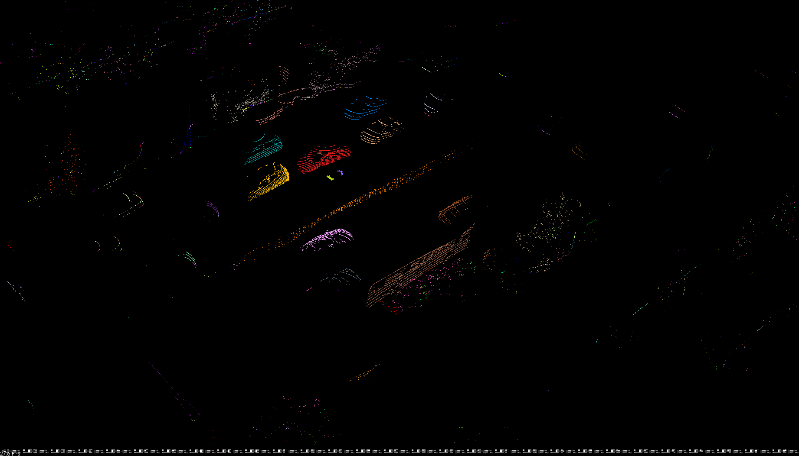
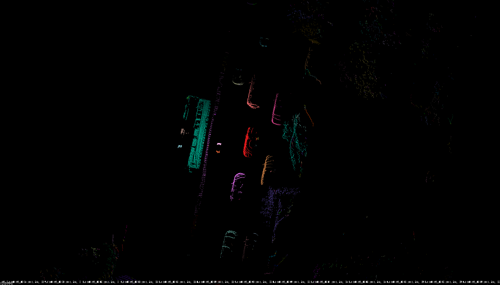

# Run_based_segmentation
A ROS node to perform `ground plane fitting` and `run_based_segmentation` for LiDAR pointcloud.




```bib
@inproceedings{Zermas2017Fast,
  title={Fast segmentation of 3D point clouds: A paradigm on LiDAR data for autonomous vehicle applications},
  author={Zermas, Dimitris and Izzat, Izzat and Papanikolopoulos, Nikolaos},
  booktitle={IEEE International Conference on Robotics and Automation},
  year={2017},
}
```

## Requirement
* [PCL](https://github.com/PointCloudLibrary/pcl)
* [ROS Kinetic](http://wiki.ros.org/kinetic/Installation/Ubuntu)
* [ROS Velodyne_driver](https://github.com/ros-drivers/velodyne)

## Run
```bash
$ catkin_make
$ rosrun points_preprocessor_usi groundplanfit
$ rosrun points_preprocessor_usi scanlinerun
```
And cluster point cloud will be published as `cluster` with different label.	
